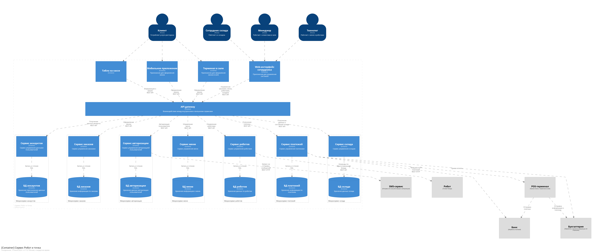

# Компонентная архитектура

### Диаграмма компонентов

На диаграмме представлены компоненты микросервисной архитектуры системы и интеграции между компонентами и внешними 
системами.

### Описание компонентов и внешних систем

| **Компонент**            | **Тип**              | **Описание**                                                        |
|:-------------------------|:---------------------|:--------------------------------------------------------------------|
| Мобильное приложение     | Container            | Приложение для оформления и просмотра заказов                       |
| Терминал в зале          | Container            | Приложение для оформления заказов                                   |
| Табло на кассе           | Container            | Приложение для просмотра статусов заказов                           |
| Web-интерфейс сотрудника | Container            | Приложение для управления системой со стороны сотрудников ресторана |
| Cервис авторизации       | Container            | Сервис управления авторизацией пользователей                        |
| База данных авторизации  | Container            | Хранение данных авторизации пользователей                           |
| Cервис аккаунтов         | Container            | Сервис управления данными пользователей                             |
| База данных аккаунтов    | Container            | Хранение персональных данных пользователей                          |
| Cервис меню              | Container            | Сервис управления меню                                              |
| База данных меню         | Container            | Хранение информации о меню                                          |
| Cервис заказов           | Container            | Сервис управления заказами                                          |
| База данных заказов      | Container            | Хранение информации по заказам                                      |
| Cервис платежей          | Container            | Сервис управления платежами                                         |
| База данных платежей     | Container            | Хранение информации по платежам                                     |
| Cервис склада            | Container            | Сервис управления складом                                           |
| База данных склада       | Container            | Хранение данных склада о продуктах                                  |
| Cервис роботов           | Container            | Сервис управления роботами                                                                    |
| База данных роботов      | Container            | Хранение данных по роботам                                                                    |
| API gateway              | Container            | Взаимодействие между внутренними и внешними сервисами                                                                    |
| Робот                    | External&nbsp;system | Приготовление блюд в ресторане                                      |
| POS-терминал             | External&nbsp;system      | Прием оплаты с терминала в зале                                     |
| SMS-сервис               | External&nbsp;system      | Отправка sms при регистрации и авторизации                          |
| Банк                     | External&nbsp;system      | Обработка платежей                                                  |
| Бухгалтерия              | External&nbsp;system      | Обработка и хранение информации об операциях   |
