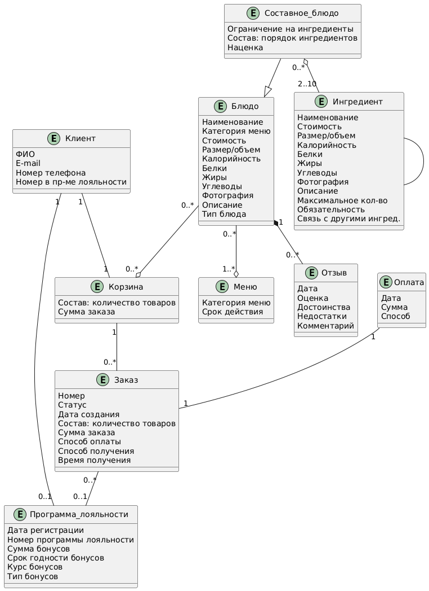

# Модель предметной области

### Диаграмма классов

В рамках MVP и первого релиза проекта были выделены основные сущности с атрибутами и определены связи между ними.

{: style="width:600px"}

### Пояснения к сущностям предметной области

| **Сущность**         | **Описание**                                                                                                                  |     |
| :------------------- | :---------------------------------------------------------------------------------------------------------------------------- | --- |
| Клиент               | Человек, пользователь, потребляющий услуги ресторана.                                                                         |     |
| Программа лояльности | Учетная запись клиента в системе. В программе лояльности ведется учет накоплений и списаний бонусов, а также история заказов. |     |
| Меню                 | Список блюд, предоставляемых рестораном. Может быть одновременно несколько меню — по кухням различных тематик, сезонны и пр.  |     |
| Блюдо                | Единица товара в меню, доступная к заказу.                                                                                    |     |
| Составное блюдо      | Разновидность блюда, в котором для клиента доступен выбор ингредиентов.                                                       |     |
| Ингредиент           | Единица, из которой складывается составное блюдо.                                                                             |     |
| Корзина              | Часть личного кабинета клиента, в которой находятся выбранные им блюда, пока из них не будет оформлен заказ.                  |     |
| Заказ                | Набор блюд, который выбрал клиент для употребления в ресторане.                                                               |     |
| Отзыв                | Мнение клиента о блюде, которое он заказывал.                                                                                 |     |
| Оплата               | Информация об оплате заказа.                                                                                                  |     |

	
	
	
	
	
	
	
	
	