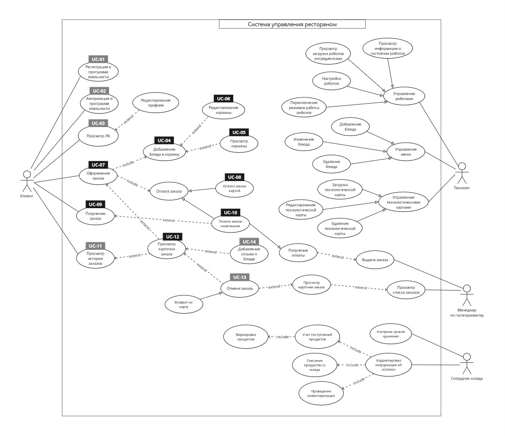

# Use сase диаграмма

Основные функции системы управления рестораном отображены на use case диаграмме:

### Use cases MVP

| **Номер** | **Название**               |
| :-------- | :------------------------- |
| UC-04     | Добавление блюда в корзину |
| UC-05     | Просмотр корзины           |
| UC-06     | Редактирование корзины     |
| UC-07     | Оформление заказа          |
| UC-08     | Оплата заказа картой       |
| UC-09     | Получение заказа           |
| UC-10     | Оплата заказа наличными    |
| UC-12     | Просмотр карточки заказа   |

### Use cases первого релиза

| **Номер** | **Название**                       |
| :-------- | :--------------------------------- |
| UC-01     | Регистрация в программе лояльности |
| UC-02     | Авторизация в программе лояльности |
| UC-03     | Просмотр ЛК                        |
| UC-11     | Просмотр истории заказов           |
| UC-13     | Отмена заказа                      |
| UC-14     | Добавление отзыва о блюде          |
