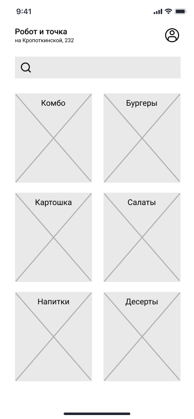

# Главный экран. Список категорий меню

Экран является реализацией сценария [UC-03 Просмотр меню](../requirements/uc03.md). 

 

### Элементы экрана

| **Элемент**             | **Описание**                                              | **Источник данных**  |
|:------------------------|:----------------------------------------------------------|:---------------------|
| Название ресторана      | Название ресторана «Робот и точка».                       | Переменная окружения |
| Адрес ресторана         | Адрес ресторана.                                          | Переменная окружения |
| ЛК программы лояльности | Ссылка, переход на [«Экран категории меню»](screen02.md). | —                    |
| Поиск                   | Строка поиска по блюдам.                                  | —                    |
| Категории               | Список категорий.                                         | Метод «Получение списка категорий меню»             |