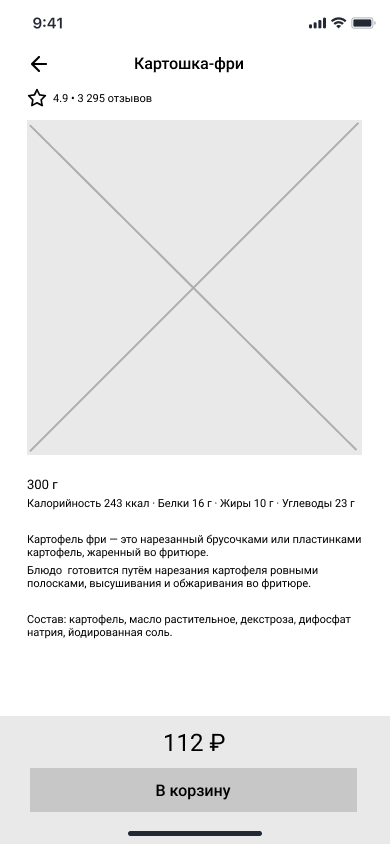
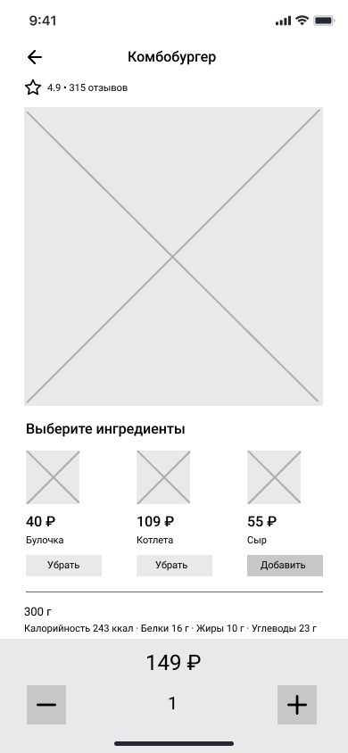

# Экран карточки блюда

Экран является реализацией сценария [UC-04 Просмотр карточки блюда](../requirements/uc04.md). 

Карточка простого блюда:

 

Карточка составного блюда:

 

### Элементы экрана

| **Элемент**   | **Описание**                                                                                                                                                                                                                                                                                                          | **Источник данных**              |
|:--------------|:----------------------------------------------------------------------------------------------------------------------------------------------------------------------------------------------------------------------------------------------------------------------------------------------------------------------|:---------------------------------|
| Назад         | Иконка возврата на главный экран.                                                                                                                                                                                                                                                                                     | —                                |
| Наименование  | Название блюда.                                                                                                                                                                                                                                                                                                       | Метод «Получение данных о блюде» |
| Рейтинг       | Средний балл рейтинга.                                                                                                                                                                                                                                                                                                | *Вне скоупа проекта*             |
| Отзывы        | Количество отзывов и ссылка на список отзывов.                                                                                                                                                                                                                                                                        | *Вне скоупа проекта*             |
| Фотография    | Изображение блюда.                                                                                                                                                                                                                                                                                                    | Метод «Получение данных о блюде» |
| Ингредиенты   | Блок выбора ингредиентов. Отображается только в карточке составного блюда. Ячейка ингредиента включает элементы: 1. Изображение 2. Стоимость 3. Наименование 4. Кнопка Добавить/Убрать По нажатию на кнопку «Добавить» ингредиент добавляется к блюду. Ячейка ингредиента не кликабельна. | *Вне скоупа проекта*             |
| Размер/объем  | Размер/объем.                                                                                                                                                                                                                                                                                                         | Метод «Получение данных о блюде» |
| Калорийность  | Количество килокалорий.                                                                                                                                                                                                                                                                                               | Метод «Получение данных о блюде» |
| Белки         | Количество белков.                                                                                                                                                                                                                                                                                                    | Метод «Получение данных о блюде» |
| Жиры          | Количество жиров.                                                                                                                                                                                                                                                                                                     | Метод «Получение данных о блюде» |
| Углеводы      | Количество углеводов.                                                                                                                                                                                                                                                                                                 | Метод «Получение данных о блюде» |
| Описание      | Описание блюда.                                                                                                                                                                                                                                                                                                       | Метод «Получение данных о блюде» |
| Стоимость     | Стоимость блюда с учетом выбранных ингредиентов.                                                                                                                                                                                                                                                                      | Метод «Получение данных о блюде» |
| В корзину     | Кнопка «В корзину». По нажатию на кнопку запускается сценарий [UC-05 Добавление блюда в корзину](../requirements/uc05.md).                                                                                                                                                                                            | —                                |
