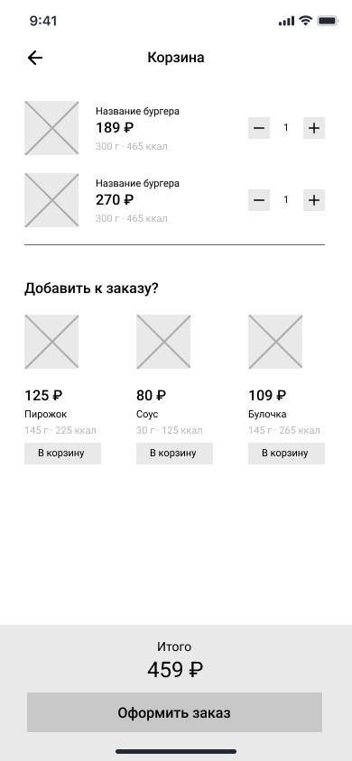

# Экран корзины

Экран является реализацией сценария [UC-06 Просмотр корзины](../requirements/uc06.md).

### Элементы экрана

| **Элемент**    | **Описание**                                                                                                                                                                                                                                                                                                                                                                       | **Источник данных**                                        |
|:---------------|:-----------------------------------------------------------------------------------------------------------------------------------------------------------------------------------------------------------------------------------------------------------------------------------------------------------------------------------------------------------------------------------|:-----------------------------------------------------------|
| Назад          | Иконка возврата на главный экран.                                                                                                                                                                                                                                                                                                                                                  | —                                                          |
| Корзина        | Заголовок экрана.                                                                                                                                                                                                                                                                                                                                                                  | —                                                          |
| Заказ          | Блок со списком блюд, добавленных в корзину. Ячейка блюда включает элементы: 1. Изображение 2. Наименование 3. Стоимость 4. Размер/объем 5. Калорийность 6. Элемент изменения количества экземпляров блюда: кнопки –/+ (Сценарий [UC-07 Редактирование корзины](../requirements/uc07.md)) По клику на ячейке блюда происходит переход в карточку блюда. | Методы «Просмотр корзины», «Получение данных о блюде» |
| Добавить к заказу?   | Блок предложений со списком блюд. Не может включать блюда, уже добавленные в корзину. Ячейка блюда включает элементы: 1. Изображение 2. Стоимость 3. Наименование 4. Размер/объем 5. Калорийность 6. Кнопка «В корзину». По нажатию на кнопку блюдо добавляется в корзину. По клику на ячейке блюда происходит переход в карточку блюда.           | *Вне скоупа проекта*                                       |
| Итого          | Стоимость блюда с учетом выбранных ингредиентов.                                                                                                                                                                                                                                                                                                                                   | Методы «Просмотр корзины»                        |
| Оформить заказ | Кнопка «Оформить заказ». По нажатию на кнопку запускается сценарий [UC-08 Оформление заказа](../requirements/uc08.md).                                                                                                                                                                                                                                                             | —                                                          |

