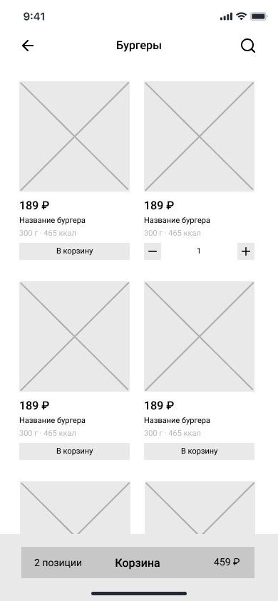

# WF-02 Категория меню. Список блюд

Экран является реализацией сценариев [UC-03 Просмотр меню](../requirements/uc03.md) и [UC-05 Добавление блюда в корзину](../requirements/uc05.md). 

### Прототип

 

### Элементы экрана

| **Элемент** | **Описание**                                                                                                                                                                                                                      | Взаимодействие с API               |
| :---------- | :-------------------------------------------------------------------------------------------------------------------------------------------------------------------------------------------------------------------------------- | :--------------------------------- |
| Назад       | Иконка возврата назад.                                                                                                                                                                                                            | —                                  |
| Категория   | Название категории блюд.                                                                                                                                                                                                          | —                                  |
| Поиск       | Иконка поиска по клику преобразуется в строку поиска по блюдам.                                                                                                                                                                   | —                                  |
| Меню        | Список блюд, относящихся к выбранной категории. Ячейка с блюдом содержит: 1. Изображение 2. Стоимость 3. Наименование 4.Размер/объем 5. Калорийность По клику на ячейку происходит переход в карточку блюда. | Метод «Получение списка блюд»      |
| В корзину   | Кнопка «В корзину». По нажатию на кнопку блюдо добавляется в корзину.                                                                                                                                                             | Метод «Добавление блюда в корзину» |
| Корзина     | Краткая информация о содержимом корзины. Элемент отображается, если в корзину добавлено хотя бы одно блюдо. Элемент содержит: 1. Количество добавленных блюд. 2. Сумма добавленных блюд.                                 | Метод «Просмотр корзины»           |

