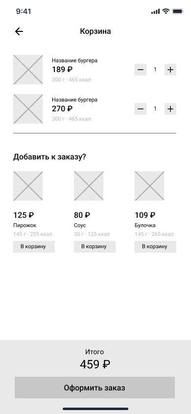

# WF-04 Корзина

Экран является реализацией сценариев [UC-06 Просмотр корзины](../requirements/uc06.md) и [UC-07 Редактирование корзины](../requirements/uc07.md).

### Прототип

### Элементы экрана

| **Элемент**        | **Описание**                                                                                                                                                                                                                                                                                                                                                     | Взаимодействие с API                                        |
| :----------------- | :--------------------------------------------------------------------------------------------------------------------------------------------------------------------------------------------------------------------------------------------------------------------------------------------------------------------------------------------------------------- | :---------------------------------------------------------- |
| Назад              | Иконка возврата назад.                                                                                                                                                                                                                                                                                                                                           | —                                                           |
| Корзина            | Заголовок экрана.                                                                                                                                                                                                                                                                                                                                                | —                                                           |
| Заказ              | Блок со списком блюд, добавленных в корзину. Ячейка блюда включает элементы: 1. Изображение 2. Наименование 3. Стоимость 4. Размер/объем 5. Калорийность 6. Элемент изменения количества экземпляров блюда: кнопки –/+. По клику на ячейке блюда происходит переход в карточку блюда.                                                    | Методы «Просмотр корзины», «Получение данных о блюде», «Ред |
| Добавить к заказу? | Блок предложений со списком блюд. Не может включать блюда, уже добавленные в корзину. Ячейка блюда включает элементы: 1. Изображение 2. Стоимость 3. Наименование 4. Размер/объем 5. Калорийность 6. Кнопка «В корзину». По нажатию на кнопку блюдо добавляется в корзину. По клику на ячейке блюда происходит переход в карточку блюда. | Метод «Добавление блюда в корзину»                          |
| Итого              | Стоимость блюда с учетом выбранных ингредиентов.                                                                                                                                                                                                                                                                                                                 | Метод «Просмотр корзины»                                    |
| Оформить заказ     | Кнопка «Оформить заказ». По нажатию на кнопку происходит переход к оформлению заказа.                                                                                                                                                                                                                                                                            | —                                                           |

