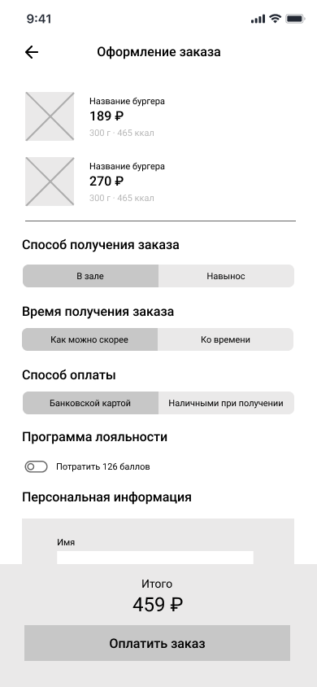
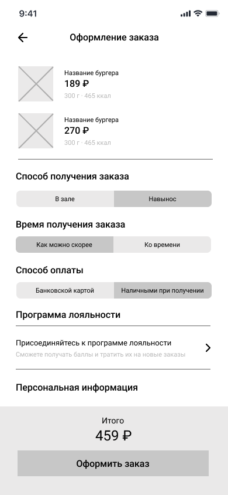

# WF-05 Оформление заказа

Экран является реализацией сценария [UC-08 Оформление заказа](../requirements/uc08.md). 

### Прототип

Пользователь авторизован в программе лояльности:

Пользователь НЕ авторизован в программе лояльности:

### Элементы экрана

| **Элемент**             | **Описание**                                                                                                                                                                                                                                                                                                                     | Взаимодействие с API                                  |
| :---------------------- | :------------------------------------------------------------------------------------------------------------------------------------------------------------------------------------------------------------------------------------------------------------------------------------------------------------------------------- | :---------------------------------------------------- |
| Назад                   | Иконка возврата назад.                                                                                                                                                                                                                                                                                                           | —                                                     |
| Оформление заказа       | Заголовок экрана.                                                                                                                                                                                                                                                                                                                | —                                                     |
| Заказ                   | Блок со списком блюд, добавленных в заказ. Ячейка блюда включает элементы: 1. Изображение 2. Наименование 3. Стоимость 4. Размер/объем 5. Калорийность По клику на ячейке блюда происходит переход в карточку блюда.                                                                                        | Методы «Просмотр корзины», «Получение данных о блюде» |
| Способ получения заказа | Выбор способа получения заказа: В зале / Навынос.                                                                                                                                                                                                                                                                                | —                                                     |
| Время получения заказа  | Выбор времени получения заказа: Как можно скорее / Ко времени. При выборе варианта «Ко времени» открывается поле для выбора времени готовности заказа.                                                                                                                                                                        | —                                                     |
| Способ оплаты           | Выбор способа оплаты: Банковской картой / Наличными при получении.                                                                                                                                                                                                                                                               | —                                                     |
| Программа лояльности    | Если пользователь авторизован, то отображается сумма баллов программы лояльности и переключатель для выбора, списывать ли баллы. Если пользователь не авторизован, то отображается ссылка для присоединения к программе лояльности. По нажатию на кнопку происходит переход к регистрации/авторизации в программе лояльности. | —                                                     |
| Персональная информация | Персональные данные пользователя. Если пользователь авторизован, данные подтягиваются из его профиля. Блок включает элементы: 1. Имя 2. Номер телефона 3. Электронная почта                                                                                                                                          | *Вне скоупа проекта*                                  |
| Итого                   | Сумма заказа с учетом скидок и баллов.                                                                                                                                                                                                                                                                                           | Метод «Просмотр корзины»                              |
| Оплатить заказ          | Кнопка «Оплатить заказ». Элемент отображается, если выбран способ оплаты заказа «Банковской картой». По нажатию на кнопку запускается процесс оплаты заказа картой.                                                                                                                                                        | —                                                     |
| Оформить заказ          | Кнопка «Оформить заказ». Элемент отображается, если выбран способ оплаты заказа «Наличными при получении». По нажатию на кнопку происходит создание заказа.                                                                                                                                                                | Метод «Оформление заказа»                             |

