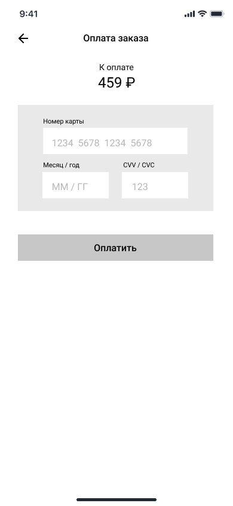

# WF-06 Оплата заказа картой

Экран является реализацией сценария [UC-09 Оплата заказа картой](../requirements/uc09.md). 

### Прототип

 

### Элементы экрана

| **Элемент**        | **Описание**                                                                                                                                       | Взаимодействие с API                               |
| :----------------- | :------------------------------------------------------------------------------------------------------------------------------------------------- | :------------------------------------------------- |
| Назад              | Иконка возврата назад.                                                                                                                             | —                                                  |
| Оплата&nbsp;заказа | Заголовок экрана.                                                                                                                                  | —                                                  |
| К оплате           | Сумма заказа к оплате.                                                                                                                             | *Вне скоупа проекта*                               |
| Номер&nbsp;карты   | Номер карты.                                                                                                                                       | —                                                  |
| Месяц / год        | Срок действия карты.                                                                                                                               | —                                                  |
| CVV / CVC          | CVV / CVC код.                                                                                                                                     | —                                                  |
| Оплатить           | Кнопка «Оплатить заказ». По нажатию на кнопку отправляется запрос в банк на оплату заказа. После успешной оплаты происходит создание заказа. | Методы «Оплата заказа картой», «Оформление заказа» |
