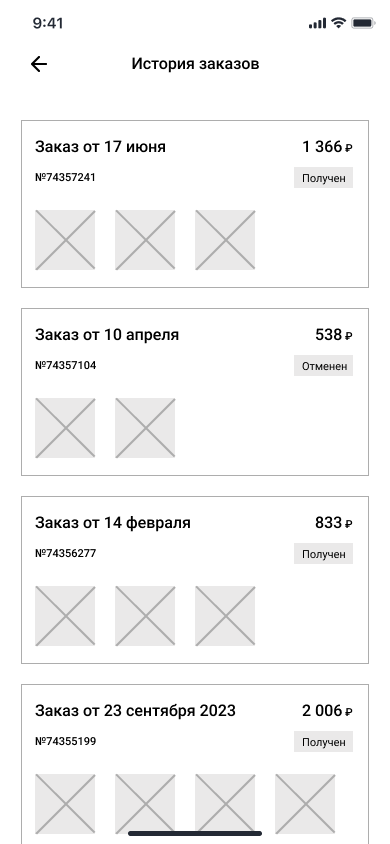

# WF-07 История заказов

!!! quote ""
    Экран является реализацией сценария [UC-11 Просмотр истории заказов](../requirements/uc11.md).

### Прототип

{: style="width:250px; border:1px #999999 solid"}

### Элементы экрана

| **Элемент**     | **Описание**                                                                                                                            | Взаимодействие&nbsp;с&nbsp;API   |
| :-------------- | :-------------------------------------------------------------------------------------------------------------------------------------- | :------------------------------- |
| Назад           | Иконка возврата назад.                                                                                                                  | —                                |
| История заказов | Заголовок экрана.                                                                                                                       | —                                |
| Список          | Список заказов пользователя. По нажатию на ячейку заказа происходит переход в карточку заказа.                                          | Метод «Просмотр истории заказов» |
| Заказ от        | Дата оформления заказа.                                                                                                                 | Метод «Просмотр истории заказов» |
| Сумма           | Сумма заказа.                                                                                                                           | Метод «Просмотр истории заказов» |
| №               | Заголовок экрана. Номер заказа.                                                                                                         | Метод «Просмотр истории заказов» |
| Статус          | Статус заказа.                                                                                                                          | Метод «Просмотр истории заказов» |
| Заказ           | Блок со списком блюд в заказе. Ячейка блюда включает изображение. По нажатию на ячейку блюда происходит переход в карточку блюда. | Метод «Просмотр истории заказов» |

