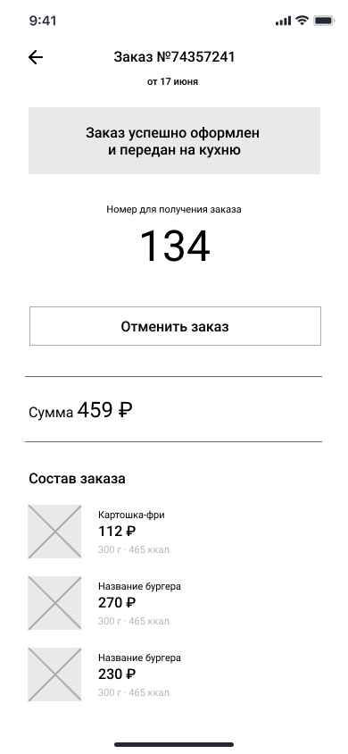

# WF-08 Карточка заказа

!!! quote ""
    Экран является реализацией сценариев [UC-12 Просмотр карточки заказа](../requirements/uc12.md), [UC-13 Отмена заказа](../requirements/uc13.md) и [UC-09 Получение заказа](../requirements/uc09.md). 

### Прототип

Статус заказа Создан:

{: style="width:250px; border:1px #999999 solid"}

Статус заказа На выдаче:

{: style="width:250px; border:1px #999999 solid"}

Статус заказа Получен:

{: style="width:250px; border:1px #999999 solid"}

### Элементы экрана

| **Элемент**                | **Описание**                                                                                                                                                                                                                                                                                                                            | Взаимодействие&nbsp;с&nbsp;API     |
| :------------------------- | :-------------------------------------------------------------------------------------------------------------------------------------------------------------------------------------------------------------------------------------------------------------------------------------------------------------------------------------- | :--------------------------------- |
| Назад                      | Иконка возврата назад.                                                                                                                                                                                                                                                                                                                  | —                                  |
| Заказ №                    | Заголовок экрана. Номер заказа.                                                                                                                                                                                                                                                                                                         | Метод «Получение данных о заказе»  |
| Дата                       | Дата оформления заказа.                                                                                                                                                                                                                                                                                                                 | Метод «Получение данных о заказе»  |
| Сообщение                  | Сообщение о статусе заказа. Отображается, если статус заказа **Создан** \| **Готовится** \| **Готов** \| **На выдаче**: — Статус заказа «Создан»: Заказ успешно оформлен и передан на кухню — Статус заказа «Готовится»: Заказ готовится — Статус заказа «Готов»: Заказ готовится — Статус заказа «На выдаче»: Заказ готов! | Метод «Получение данных о заказе»  |
| Номер для получения заказа | Номер для получения заказа в ресторане.                                                                                                                                                                                                                                                                                                 | Метод «Получение данных о заказе»  |
| Отменить заказ             | Кнопка для отмены заказа. Отображается, если статус заказа **Создан**. По нажатию на кнопку запускается процесс отмены заказа.                                                                                                                                                                                                      | —                                  |
| Штрих-код                  | Штрих-код для получения заказа в зале. Отображается, если статус заказа На выдаче. Изображение штрих-кода можно увеличить.                                                                                                                                                                                                              | —                                  |
| Сумма                      | Сумма заказа.                                                                                                                                                                                                                                                                                                                           | Метод «Получение данных о заказе»  |
| Статус заказа              | Статус заказа. Отображается, если статус заказа **Получен** \| **Отменен** \| **Самоотказ**.                                                                                                                                                                                                                                            | Метод «Получение данных о заказе»  |
| Начислено                  | Количество начисленных баллов лояльности. Отображается, если статус заказа **Получен** и если баллы лояльности были начислены.                                                                                                                                                                                                          | Метод «Получение данных о заказе»  |
| Состав заказа              | Блок со списком блюд в заказе. Ячейка блюда включает элементы: 1. Изображение 2. Наименование 3. Стоимость 4. Размер/объем 5. Калорийность По клику на ячейке блюда происходит переход в карточку блюда.                                                                                                        | Методы «Получение данных о заказе» |
| Добавить отзыв             | Кнопка к каждому из блюд в списке. Отображается, если статус заказа **Получен** и если пользователь еще НЕ добавлял свой отзыв к блюду. По нажатию на кнопку запускается процесс добавления отзыва.                                                                                                                                     | —                                  |
| Посмотреть отзыв           | Кнопка к каждому из блюд в списке. Отображается, если статус заказа **Получен**и если пользователь добавил свой отзыв к блюду. По нажатию на кнопку происходит просмотр отзыва.                                                                                                                                                         | —                                  |

