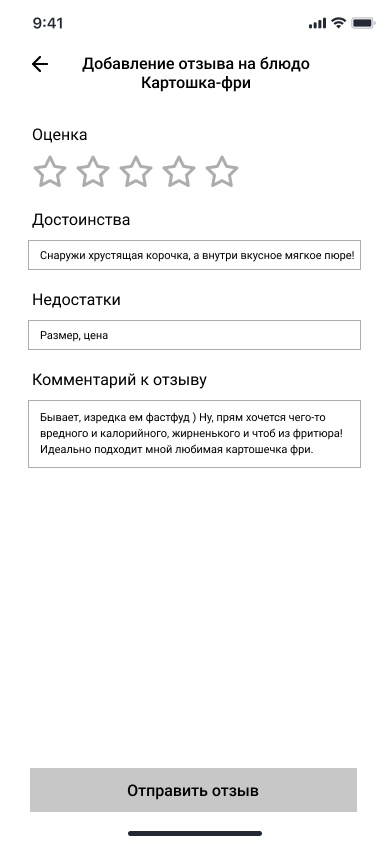

# WF-09 Добавление отзыва о блюде

!!! quote ""
    Экран является реализацией сценария [UC-16 Добавление отзыва о блюде](../requirements/uc16.md). 

### Прототип

{: style="width:250px; border:1px #999999 solid"}

### Элементы экрана

| **Элемент**                | **Описание**                                                                  | Взаимодействие&nbsp;с&nbsp;API    |
| :------------------------- | :---------------------------------------------------------------------------- | :-------------------------------- |
| Назад                      | Иконка возврата назад.                                                        | —                                 |
| Добавление отзыва на блюдо | Заголовок экрана. Название блюда, на которое добавляется отзыв.               | —                                 |
| Оценка                     | Выбор оценки по пятибалльной системе.                                         | —                                 |
| Достоинства                | Текстовое поле для описания достоинств блюда.                                 | —                                 |
| Недостатки                 | Текстовое поле для описания недостатков блюда.                                | —                                 |
| Комментарий к отзыву       | Текстовое поле для комментария к отзыву.                                      | —                                 |
| Отправить отзыв            | Кнопка «Отправить отзыв». По нажатию на кнопку  происходит сохранение отзыва. | Метод «Добавление отзыва о блюде» |
