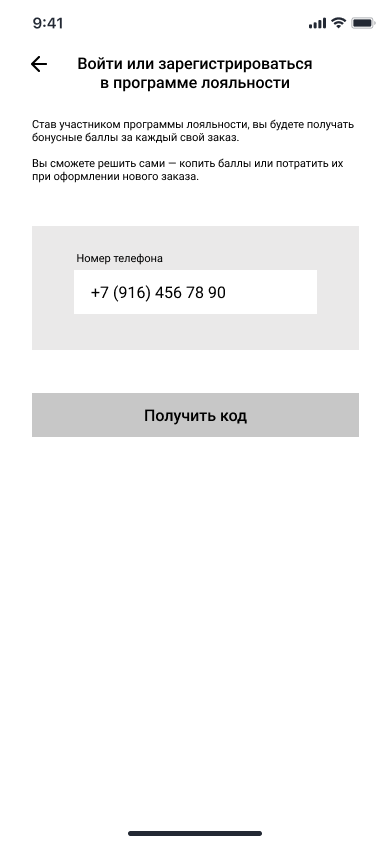
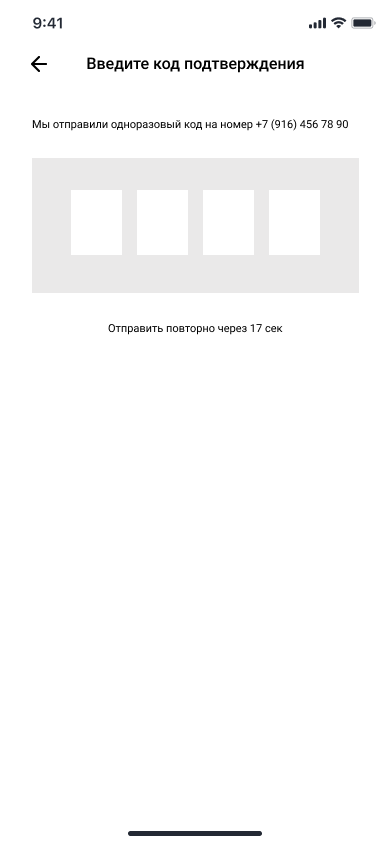

# WF-10 Регистрация/авторизация

!!! quote ""
    Экран является реализацией сценариев [UC-01 Регистрация в программе лояльности](../requirements/uc01.md) и [UC-02 Авторизация в программе лояльности](../requirements/uc02.md).

### Прототип

Регистрация/авторизация в программе лояльности:

{: style="width:250px; border:1px #999999 solid"}

Ввод кода подтверждения:

{: style="width:250px; border:1px #999999 solid"}
### Элементы экрана

| **Элемент**        | **Описание**                                                                                                                                                                                                                                                     | Взаимодействие&nbsp;с&nbsp;API                                                                      |
| :----------------- | :--------------------------------------------------------------------------------------------------------------------------------------------------------------------------------------------------------------------------------------------------------------- | :-------------------------------------------------------------------------------------------------- |
| Назад              | Иконка возврата назад.                                                                                                                                                                                                                                           | —                                                                                                   |
| Заголовок          | Заголовок экрана.                                                                                                                                                                                                                                                | —                                                                                                   |
| Текст              | Информация о программе лояльности                                                                                                                                                                                                                                | —                                                                                                   |
| Номер телефона     | Поле для ввода номера телефона.  Ввод по маске +X (XXX) XXX XX XX. Допустимые символы: цифры от 0 до 9.                                                                                                                                                    | —                                                                                                   |
| Получить код       | Кнопка «Получить код». По нажатию на кнопку sms с кодом подтверждения отправляется на указанный номер телефона. На экране отображается поле для ввода кода подтверждения.                                                                                     | *Вне скоупа проекта*                                                                                |
| Код                | Поле для ввода кода подтверждения. Длина 4 знака. Допустимые символы: цифры от 0 до 9.  Отправка запроса на проверку кода происходит автоматически после всех 4-х знаков кода. После успешной проверки кода происходит авторизация пользователя в сервисе. | Методы «Отправка кода подтверждения», «Создание нового пользователя», «Аутентификация пользователя» |
| Отправить повторно | Счетчик времени до возможности повторной отправки кода подтверждения.  По истечении таймера ссылка становится активной. По нажатии на ссылку происходит повторная отправка кода подтверждения.                                                                | —                                                                                                   |

