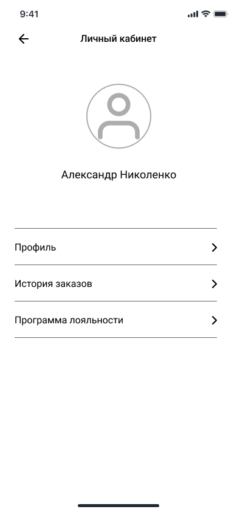

# WF-11 Просмотр ЛК программы лояльности

!!! quote ""
    Экран является реализацией сценария [UC-03 Просмотр ЛК программы лояльности](../requirements/uc03.md).

### Прототип

Пользователь не авторизован:

{: style="width:250px; border:1px #999999 solid"}

Пользователь авторизован:

{: style="width:250px; border:1px #999999 solid"}
### Элементы экрана

| **Элемент**          | **Описание**                                                                                                                                                      | Взаимодействие&nbsp;с&nbsp;API              |
| :------------------- | :---------------------------------------------------------------------------------------------------------------------------------------------------------------- | :------------------------------------------ |
| Назад                | Иконка возврата назад.                                                                                                                                            | —                                           |
| Заголовок            | Заголовок экрана «Личный кабинет».                                                                                                                                | —                                           |
| Войти                | Кнопка «Войти». Элемент отображается, если пользователь не авторизован. По нажатию происходит переход к регистрации/авторизации в системе.                     | —                                           |
| Пользователь         | Имя и фамилия пользователя. Элемент отображается, если пользователь авторизован. Если имя и фамилия не заполнены, то отображается номер телефона пользователя. | Метод «Получение информации о пользователе» |
| Профиль              | Ссылка. Элемент отображается, если пользователь авторизован. По нажатию происходит переход к данным пользователя.                                              | —                                           |
| История заказов      | Ссылка. Элемент отображается, если пользователь авторизован. По нажатию происходит переход к списку заказов.                                                   | —                                           |
| Программа лояльности | Ссылка. Элемент отображается, если пользователь авторизован. По нажатию происходит переход экрану программы лояльности.                                        | —                                           |

