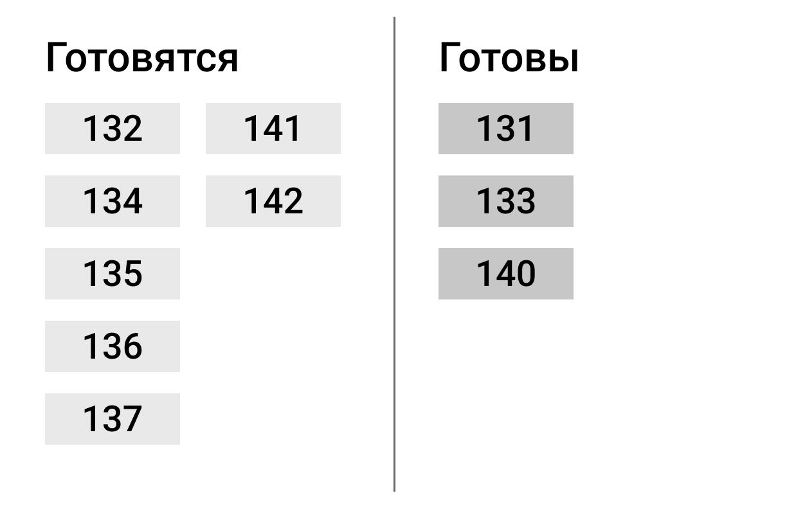

# WF-12 Табло в зале

!!! quote ""
    Экран является реализацией сценария [UC-09 Получение заказа](../requirements/uc09.md).

### Прототип

{: style="width:400px; border:1px #999999 solid"}
### Элементы экрана

| **Элемент** | **Описание**                                                                       | Взаимодействие&nbsp;с&nbsp;API   |
| :---------- | :--------------------------------------------------------------------------------- | :------------------------------- |
| Готовятся   | Отображается список заказов со статусами **Создан** \| **Готовится** \| **Готов**. | Метод «Получение статуса заказа» |
| Готовы      | Отображается список заказов со статусом **На выдаче**.                             | Метод «Получение статуса заказа» |

